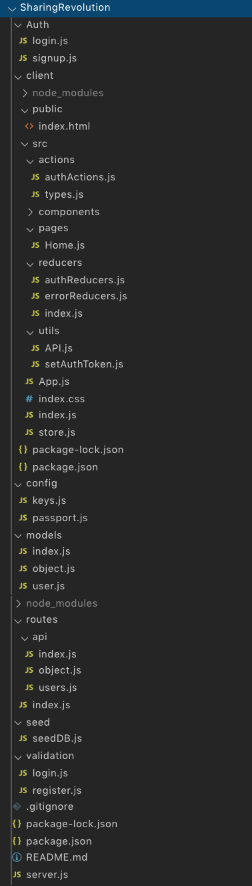

## Sharing Revolution

**What does this application do and why?**

* Users can login and purchase items with points.
* Allows people to sell their unused items to people who need them.
* How people to purchase items from people who no longer need them.

**How the application is organized**

Sharing Revolution is organized into the following files: 

**Step-by-Step on how to run the application**

**Link to deployed version of Sharing Revolution**

Heroku:
GitHub Repository:

**Technologies Used** 

* React.js
* Node.js
* Express
* MongoDB
* Mongoose
* GET and POST routes
* Heroku
* Redux
* Passport
* HTML
* CSS
* Javascript ES6
* Folder structure that meets MVC Paradigm
* Validator
* IsEmpty
* Bootstrap
* jQuery
* Axios
* Jwt_decode
* React-router-dom
* Prop-types
* React-redux
* Classnames
* Redux-thunk
* Passport-jwt
* Jsonwebtoken
* Bcryptjs
* Path
* Body-parser
* Morgan

**Roles**

All files are written by ckalorkoti.
